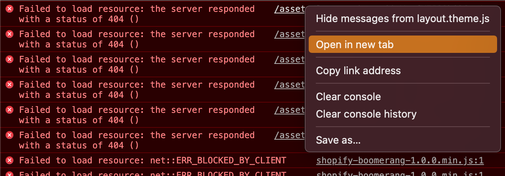
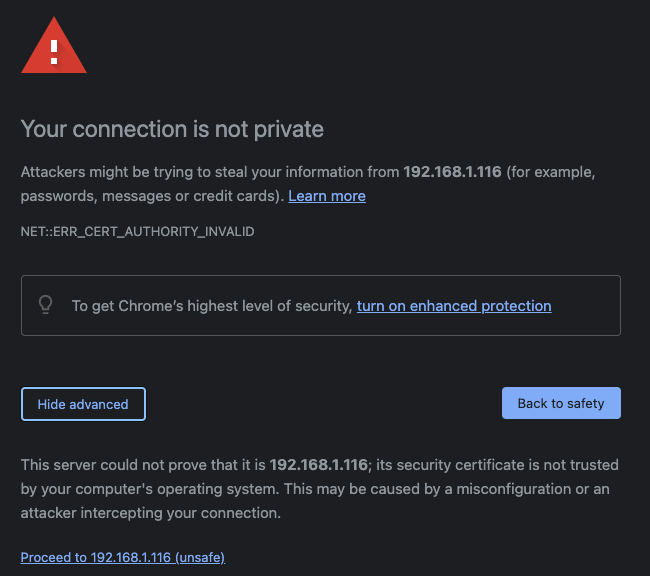

# Guide

## Environments

### Managing Multiple Environments

By default, Theme Packer will use the `.env` file in your project root and pass any keys prefixed with `SHOPIFY_` to [@shopify/themekit](https://github.com/Shopify/node-themekit). You can however pass an `--env=[env]` flag to the cli, which will then use environment variables from an associated `.env.[env]` file. For example:

```bash
theme-packer deploy --env="dev"
```
will use the environment variables defined in your `.env.dev` file.

::: tip
You can deploy to multiple environments at once by passing multiple `--env` flags to the `deploy` command. For example:

```bash
theme-packer deploy --env="uk" --env="us" --env="eu"
```

This will skip run one initial build before deploying to each environment.
:::

It's common practice to keep multiple env files for various reasons. For example you might require `dev`, `staging` and `production` environments through your development lifecycle. Or, if you deploy to multiple stores in various regions you might keep region-specific environments, like `uk`, `us` and `eu`.

### Using config.yml

If you prefer to manage your environments in a `.yml` file much like how ThemeKit does, you can simply provide a `SHOPIFY_CONFIG` key in your `.env` file, for example:

```bash
SHOPIFY_CONFIG=config.yml
```

This tells Theme Packer to use `config.yml` instead of an environment file. Please note however that when passing environment flags to match environments set up inside your config, you will need to use the `-e` shorthand flag, instead of `--env`.

## Ignoring Files

Much like how you might have a `.gitignore` in your repository to avoid committing your `node_modules` directory, you may find that there are theme files you need to avoid uploading to Shopify. For example, it's common to ignore the `settings_data.json` file to avoid overwriting all of the theme settings that have changed in the customiser.


ThemeKit provides two options for ignoring file updates: managing your ignore list per-environment, or managing your ignorelist in a separate file. You are fine to do either, using either `SHOPIFY_IGNORE_FILES` in your `.env` files to manage them on an environment level, or using `SHOPIFY_IGNORES` in your `.env` file to manage them in a separate folder. The standard boilerplate for a Theme Packer project uses an ignorefile by default, called `.themekitignore`, and this file is tracked in Git. The reason for this is that it's safer when working in teams to share an ignore file rather than manually keeping individual `.env` files in sync.

## Section Schemas

We often need schema options to be shared across multiple sections. We might for example need a predefined set of colours available to style some sections. Theme Packer allows you to write your section schemas separately as JavaScript modules and import them with a custom tag. To do so add a `schema` tag in the following format: ``, where `[import]` is the name of the schema module in your `/src/schemas` directory. You can read more about it here: [Liquid Schema Plugin](https://github.com/davidwarrington/liquid-schema-plugin).

Input: `section.js`
```js
module.exports = {
    name: 'Section',
    settings: [
        //...
    ],
    blocks: [
        //...
    ],
};
```

Input: `section.liquid`
```html



```

Output: `section.liquid`
```html



{
    "name": "Section",
    "settings": [],
    "blocks": []
}

```

## Always Use External URLs

Sometimes you might be forced to work on your theme via a live url, such as a `.myshopify.com` url. In such cases if you may need to enable `assets.always-external-urls` in your `theme-packer.config.js`.

```js
module.exports = {
    'assets.always-external-urls': true,
};
```

This will ensure that every JS and CSS tag generated by Theme Packer points to the external BrowserSync URL, rather than your `localhost` address.

After launching Theme Packer with this enabled, if you find that they're not loading, open the console in your browser, right click the url for one of the assets and click "Open in new tab", or your browsers equivalent.



You will should then find your browser presents a warning page. Click the "Advanced" button, followed by the "Proceed to [URL]" link. Now you should find that the assets will load for you.



You may have to follow these steps again periodically, which used to cause a lot of confusion amongst users of Slate, which is why `assets.always-external-urls` is not enabled by default.
